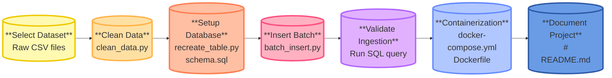

# DLBDSEDE02 - Data Engineering Project 
## Task 1: Choose a suitable database and store the data in batches  


## Objective

The goal of this project is to build a batch data ingestion system for environmental sensor data. The system includes data cleaning, transformation, and storage into a 
PostgreSQL database using Docker for portability and reproducibility.

## Setup and Installation

1. Clone the repository:
   ```
   git clone https://github.com/SkyFly03/DLBDSEDE02-Data-Engineering.git
   cd DLBDSEDE02-Data-Engineering
   ```

2. Create and activate the virtual environment:
   ```
   python -m venv venv
   .\venv\Scripts\Activate.ps1
   ```

3. Install dependencies:
   ```
   pip install -r requirements.txt
   ```

4. Start PostgreSQL container using Docker:
   ```
   docker-compose up -d
   ```

## Workflow Overview



## Process Description

### 1. Dataset

* Dataset: Air Quality Data in India  
* Source: [Kaggle – Air Quality Data](https://www.kaggle.com/datasets/rohanrao/air-quality-data-in-india)  
* Description: The dataset includes hourly and daily air pollution measurements collected from various Indian cities. Parameters include PM2.5, PM10, NOx, SO2, O3, and AQI.

### 2. Data Cleaning

* `clean_data.py` processes `station_hour.csv`:
  - Normalizes column names
  - Converts datetime
  - Removes rows with missing PM2.5 or PM10
  - Adds metadata (source and ingestion timestamp)
  - Saves output as `air_quality_cleaned.csv`

### 3. Database Setup

* `recreate_table.py` connects to PostgreSQL and recreates the `air_quality` table with the proper schema
* `schema.sql` provides the same structure in raw SQL format

### 4. Batch Insertion

 
* `batch_insert.py` loads cleaned data and inserts it into PostgreSQL in chunks
* Connection uses SQLAlchemy
* Batch size: 10,000 rows
 

### 5. Ingestion Validation


* `test_connection.py` verifies database credentials and connection
* A `SELECT COUNT(*)` query confirms that the records were successfully ingested

### 6. Containerization

  
* PostgreSQL runs in a Docker container via `docker-compose.yml`
* Consistent setup across systems without manual installation  
* Deployment supported to cloud platforms and horizontal scaling with tools like Kubernetes
* Flexible structure for future extensions as streaming or microservices

### 7. Documentatation

* in code and `README.md`
---

## Project Structure

```
DLBDSEDE02-Data-Engineering/
├── data/
│   └── (large .csv files excluded from repo)
├── images/
│   ├── insert_output.png (2)
│   ├── count_rows.png
│   └── docker_ps.png
├── scripts/
│   ├── batch_insert.py 
│   ├── check_columns.py 
│   ├── clean_data.py
│   ├── recreate_table.py
│   └── test_connection.py
├── .gitignore 
├── Dockerfile
├── README.md
├── docker-compose.yml
├── requirements.txt
└── schema.sql
```
---
